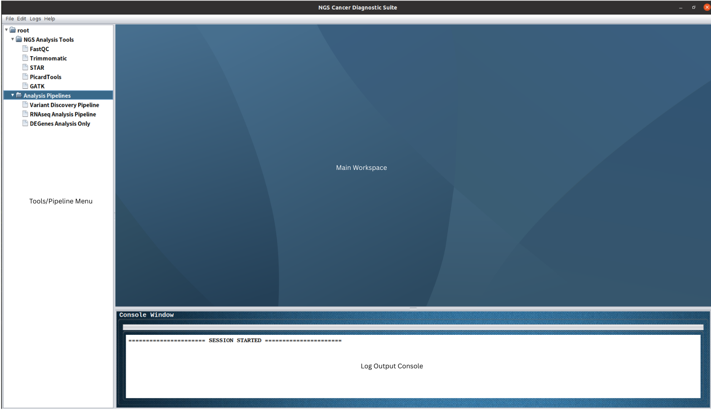
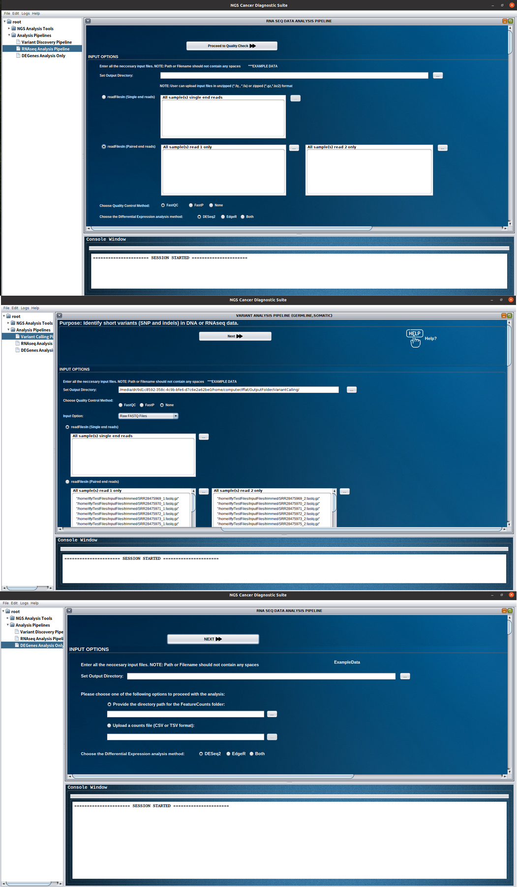
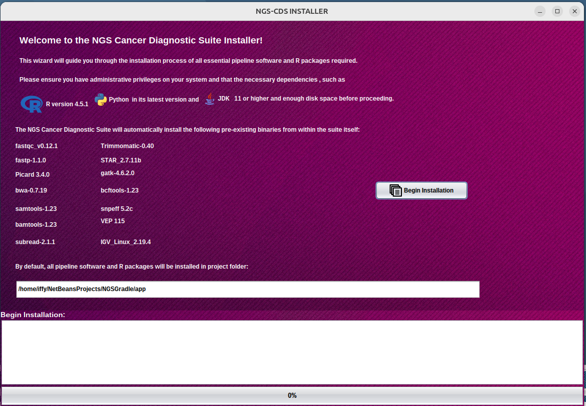
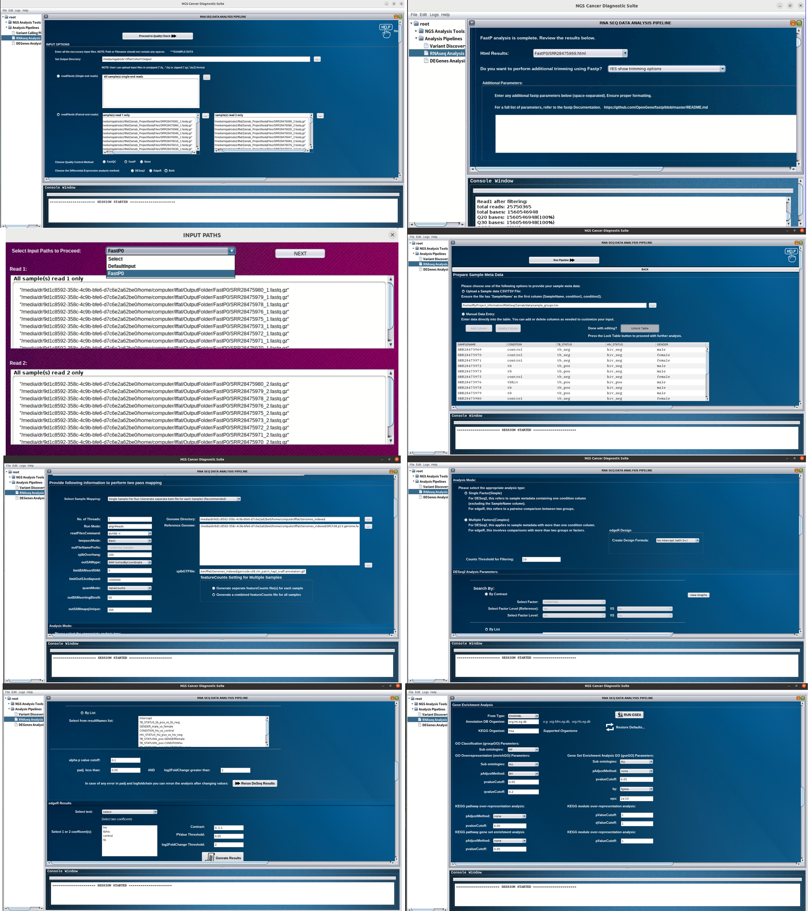
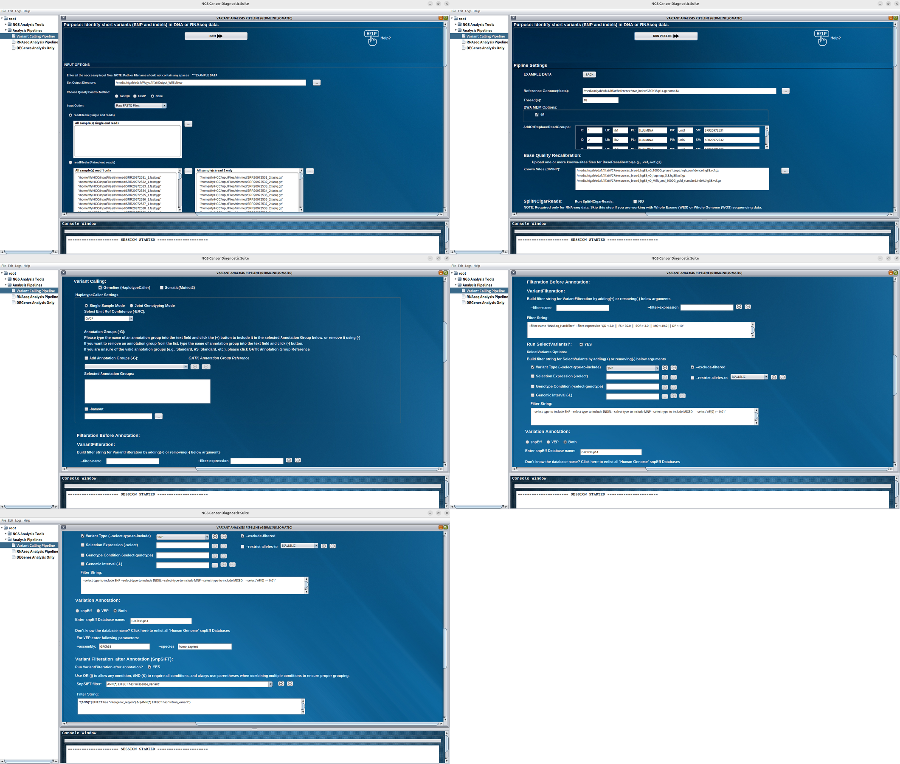

# NGS-CDS


## Table of Contents

- [Overview](#overview)
- [Key Features](#key-features)
- [Additional Downloads](#additional-downloads)
- [Installation](#installation)
- [Pipelines at a Glance](#pipelines-at-a-glance)
- [System Requirements](#system-requirements)
- [Repository Structure](#repository-structure)
- [Downstream Reporting](#downstream-reporting)
- [Citation](#citation)
- [License](#license)

## NGS Cancer Diagnostic Suite

An open-source offline graphical platform for end-to-end cancer NGS analysis.

### Main Dashboard



## Overview

NGS Cancer Diagnostic Suite is an open-source suite designed specifically for Linux users to revolutionize NGS data analysis in cancer diagnostics. It provides a user-friendly graphical interface that eliminates the need for complex coding, delivering a streamlined, reproducible workflow for researchers and clinicians.

Unlike a single monolithic tool, NGS-CDS is structured as a collection of modular components. Each module specializes in handling a specific type of data format, simplifying analysis at every stage — from raw reads to clinically meaningful variants.

### RNA-seq & Variant Calling Pipelines



## Key Features

- **GUI Based** — Point-and-click interface for running complex NGS pipelines. No command-line coding required.
- **Modular Architecture** — Plug-and-play modules for each data format and analysis stage.
- **Two End-to-End Pipelines** — Ready-to-run workflows for the most common cancer genomics use cases:
  1. RNA-seq Analysis Pipeline
  2. Variant Calling Pipeline
- **Offline Operation** — Once dependencies are installed, the suite works fully offline. No cloud calls, no remote APIs.
- **Dedicated GUIs for Popular Tools** — Built-in graphical wrappers for selected tools including STAR and GATK, so users can leverage their preferred tools without leaving the suite.
- **Resume Capability** — Interrupted runs pick up exactly where they left off. No need to restart an alignment or variant call from scratch after a crash or shutdown.
- **Status Tracking** — Keep track of every job, module, and pipeline stage. Know what's running, and what's finished at a glance.
- **Local execution** — Runs entirely on the local machine. No sequencing data is sent to external servers — ideal for institutions with strict data-privacy.
- **Log Maintenance** — Every pipeline execution generates detailed, structured logs for auditing, debugging, reproducibility, and publication-grade reporting. A Console Window inside the GUI shows pipeline output, and pipeline-specific logs can be saved as `.txt` files for later review.
- **PDF Report Generation** — Downstream R-based reporting produces publication-ready PDFs from annotated VCFs, including tumor mutational burden, gene-level penetrance, and hotspot variant summaries.

## Additional Downloads

The following components are not included in this GitHub repository because they exceed GitHub's storage limits.

| Component      | Description                                                                          |
|----------------|--------------------------------------------------------------------------------------|
| `bin/R_Packages/` | Offline R and Bioconductor package repository required for offline installation   |
| `zipbin/`      | Archived third-party bioinformatics software packages used during installation       |

These files can be downloaded from Google Drive:

- **bin/R_Packages/** [Download `R_Packages`](https://drive.google.com/drive/folders/1kgZMNtEn8zR5TPataWeCktIJYuqXgnQ7?usp=drive_link)
- **zipbin/** [Download `zipbin`](https://drive.google.com/drive/folders/1g9_PUkYgnpcdconrORYLkKlVsqSS6_0q?usp=sharing)

**Note:** Download both folders and place them in the appropriate project directories before running the offline installer. Please refer to the installation instructions for the required folder structure.

## Installation

1. Download the latest release.
2. Run the installer (only once):

   ```bash
   java -jar installNGS.jar
   ```

3. After installation, launch the application:

   ```bash
   java -jar NGSSuite.jar
   ```

Alternatively, after the initial installation, launch the application from the desktop shortcut or application menu if available.



## Pipelines at a Glance

### 1. RNA-seq Analysis Pipeline

End-to-end transcriptomic analysis for cancer research — quality control, alignment, quantification, differential expression, and pathway inspection.

### 2. Variant Calling Pipeline

Germline and somatic variant detection and annotation optimized for cancer genomes — built around GATK best practices with downstream clinical-style reporting.

Both pipelines follow best-practice parameters out of the box, while remaining configurable for advanced users.


The combined parameter configuration interface for the RNA-Seq pipeline (QC → alignment → quantification → differential expression → functional enrichment).



The combined parameter configuration interface for the Variant Calling pipeline (alignment → BQSR → variant calling → annotation → filtering).



## System Requirements

### Operating System

- Linux
- 64 bit or 32 bit version

### Hardware Requirements

| Component | Minimum           | Recommended                              |
|-----------|-------------------|------------------------------------------|
| Memory    | 8 GB              | 16 GB (for large datasets)               |
| Processor | Dual-core         | Quad-core processor or higher            |
| Storage   | 20 GB free disk space | 100 GB or more (depending on dataset size) |

### Software Dependencies

| Dependency                | Required Version   |
|---------------------------|---------------------|
| Operating System          | Linux (64-bit recommended) |
| Java Development Kit | 11 or higher      |
| R                         | 4.5.1               |
| Python                    | 3.8 or higher       |

## Repository Structure

```
NGS-CDS/
├── src/                           # Java source code
│
├── lib/                           # Third-party Java libraries
│
├── bin/                           # Bioinformatics tools and pipeline scripts
│   ├── *.sh                       # Bash pipeline scripts
│   ├── *.R                        # R analysis scripts
│   ├── picard.jar
│   ├── Tool directories
│   └── R_Packages/                # Offline CRAN/Bioconductor packages — Download separately from the Google Drive link provided above.
│
├── images/                        # Application icons and graphical resources
├── logs/                          # Execution and analysis logs
├── zipbin/                        # Archived offline software packages — Download separately from the Google Drive link provided above.
├── NGSSuite.jar                   # Main application
├── installNGS.jar                 # Run-once installer
├── User_Manual.pdf                # Complete software documentation
├── build.gradle                   # Gradle build configuration
├── config.properties              # Application configuration
├── README.md                      # Project overview and quick start guide
├── LICENSE
└── .gitignore
```

## Downstream Reporting

### RNA-Seq — Differential Expression & Functional Enrichment Report

The suite ships with an R Markdown-based report generator. After gene/transcript quantification, the report produces:

- **Differential Expression with DESeq2 & edgeR** — consensus DEG lists, volcano/MA plots, top-gene heatmaps, and intersection summaries
- **GO Classification (clusterProfiler::groupGO)** — high-level ontology grouping across DEGs
- **GO Over-Representation (enrichGO)** — BP/MF/CC term enrichment among DEGs
- **GO Gene Set Enrichment (gseGO)** — ranked-list GSEA on GO terms
- **KEGG Over-Representation (enrichKEGG)** — pathway-level enrichment among DEGs
- **KEGG Gene Set Enrichment (gseKEGG)** — ranked-list GSEA on KEGG pathways
- **KEGG Module Over-Representation (enrichMKEGG)** — higher-order KEGG module hits
- **KEGG Module Gene Set Enrichment (gseMKEGG)** — ranked-list GSEA on KEGG modules
- **KEGG Pathway Visualization (pathview)** — colored gene overlays on pathway diagrams
- **Reactome Pathway Profiling** — Reactome-level enrichment over DEGs
- **Human Disease Ontology Integration** — disease-associated term enrichment, complementing KEGG and Reactome

Reports are output as fully styled PDFs and PNGs with publication-quality figures, enrichment dot/bar/concept plots, and a session-level reproducibility footer.

### Variant Calling — Clinical & Biological Cohort Evaluation Report

The suite ships with an R Markdown-based report generator. After variant annotation, the report produces:

- **Executive Summary** — sample counts, variant totals, distinct genes
- **Per-Sample Mutation Burden** — for hypermutator screening
- **Gene-Level Penetrance** — driver vs. passenger distinction
- **Hotspot Variant Frequencies** — recurrent mutation positions across the cohort
- **High/Moderate Impact Variant Filtering** — clinical-grade prioritization
- **Protein-Altering Variant Prevalence** — HGVS.p level carrier frequencies

Reports are output as fully styled PDFs and PNGs with tables, figures, and a session-level reproducibility footer.

## Citation

A formal citation will be provided upon publication of the associated research work.

## License

This software is currently under active development as part of a PhD research project. Licensing information will be provided after publication of the associated research work.
